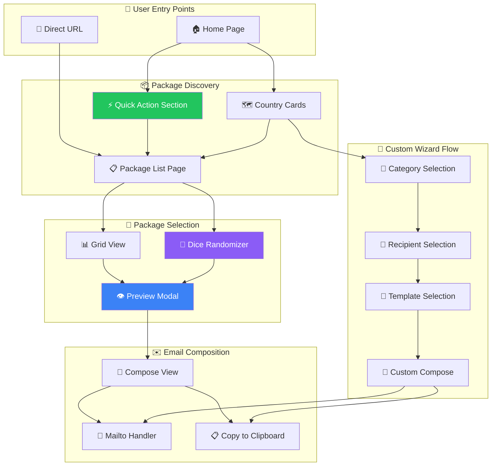
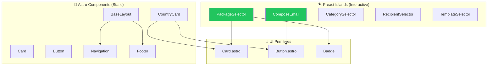

# SendForIran - System Architecture

This document provides visual diagrams of the email package system architecture.

## System Overview



## Data Architecture

```mermaid
flowchart LR
    subgraph DataLayer["📁 Data Layer"]
        Packages[(packages/*.json)]
        Recipients[(recipients/*.json)]
        Templates[(templates/**/*.json)]
        I18n[(i18n/*.json)]
    end

    subgraph LibLayer["⚙️ Library Layer"]
        PackagesLib[packages.ts]
        DataLib[data.ts]
        I18nLib[i18n.ts]
        MailtoLib[mailto.ts]
    end

    subgraph ComponentLayer["🧩 Component Layer"]
        PackageSelector[PackageSelector.tsx]
        ComposeEmail[ComposeEmail.tsx]
        CategorySelector[CategorySelector.tsx]
        RecipientSelector[RecipientSelector.tsx]
        TemplateSelector[TemplateSelector.tsx]
    end

    subgraph PageLayer["📄 Page Layer"]
        PackagesPage[/packages/country/]
        ComposePage[/country/category/compose/]
        HomePage[/]
        CountryPage[/country/]
    end

    Packages --> PackagesLib
    Recipients --> DataLib
    Templates --> DataLib
    I18n --> I18nLib

    PackagesLib --> PackageSelector
    DataLib --> CategorySelector
    DataLib --> RecipientSelector
    DataLib --> TemplateSelector
    I18nLib --> PackageSelector
    I18nLib --> ComposeEmail

    PackageSelector --> PackagesPage
    ComposeEmail --> ComposePage
    CategorySelector --> CountryPage
    RecipientSelector --> CountryPage
    TemplateSelector --> CountryPage

    style Packages fill:#f59e0b,color:#000
    style PackagesLib fill:#8b5cf6,color:#fff
    style PackageSelector fill:#3b82f6,color:#fff
```

## Component Hierarchy



## File Structure

```
src/
├── pages/
│   ├── index.astro                    # English home
│   ├── packages/[country].astro       # Package selection
│   ├── [country]/index.astro          # Wizard entry
│   ├── [fa|de|fr]/                    # Localized versions
│   └── 404.astro
├── islands/                           # Interactive Preact components
│   ├── PackageSelector.tsx            # 🆕 Package grid/dice view
│   ├── ComposeEmail.tsx               # Email composer
│   ├── CategorySelector.tsx           # Category multi-select
│   ├── RecipientSelector.tsx          # Recipient picker
│   └── TemplateSelector.tsx           # Template browser
├── components/                        # Static Astro components
│   ├── CountryCard.astro              # Enhanced with package badge
│   └── ui/
│       ├── Card.astro
│       └── Button.astro
├── lib/                               # Utilities
│   ├── packages.ts                    # 🆕 Package operations
│   ├── data.ts                        # Recipient/template loading
│   ├── i18n.ts                        # Translations
│   └── mailto.ts                      # Email URL generation
└── layouts/
    └── BaseLayout.astro

data/
├── packages/                          # 🆕 Email packages
│   ├── united-states.json
│   ├── united-kingdom.json
│   ├── germany.json
│   ├── france.json
│   └── canada.json
├── recipients/                        # Contact lists
│   └── {country}.json
├── templates/                         # Email templates
│   └── countries/{country}/{lang}/
└── i18n/                              # UI translations
    ├── en.json
    ├── fa.json
    ├── de.json
    └── fr.json
```

